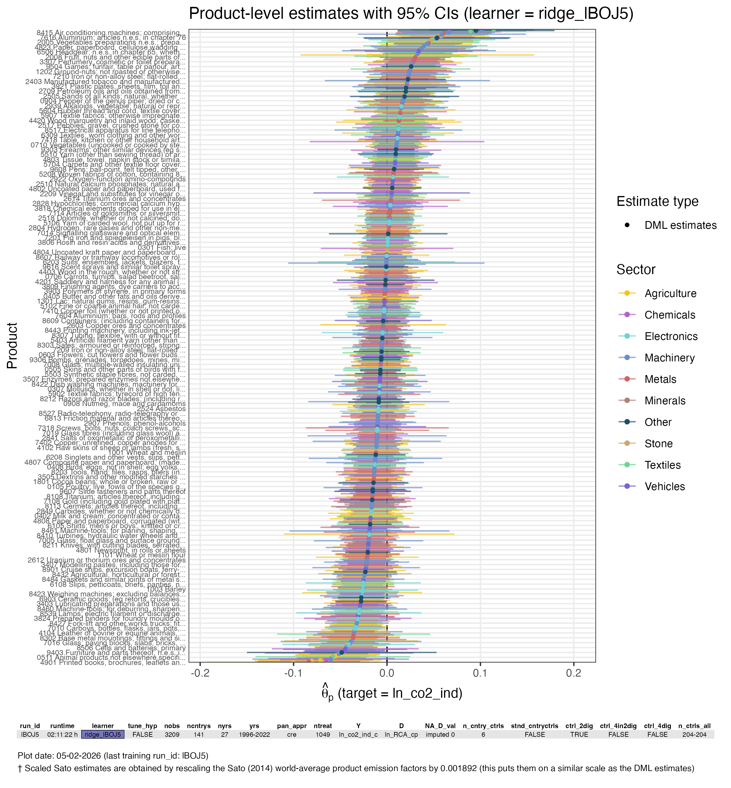
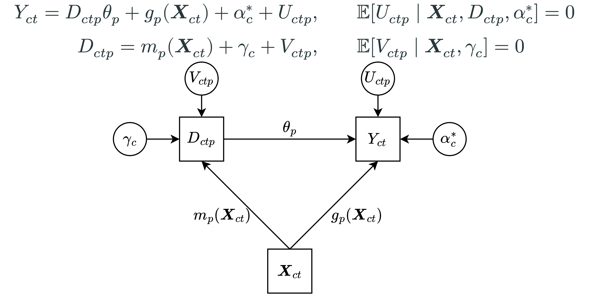
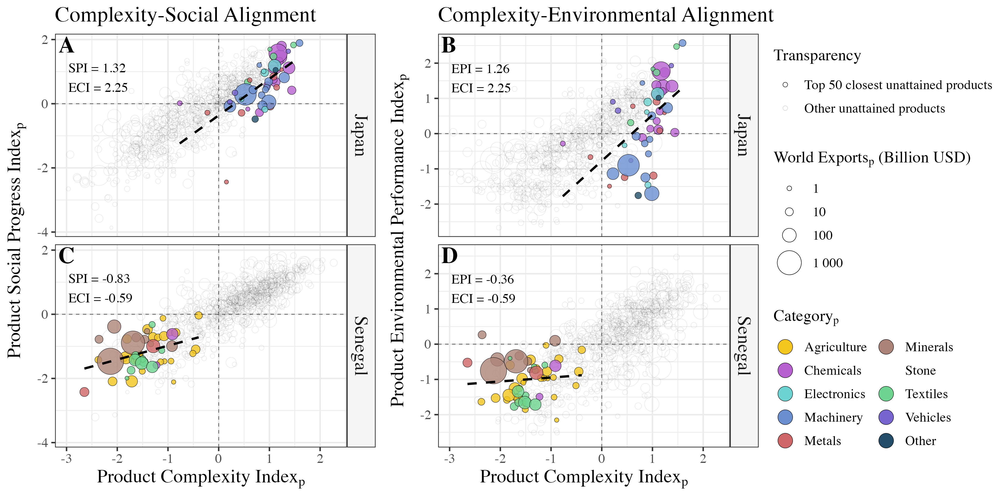
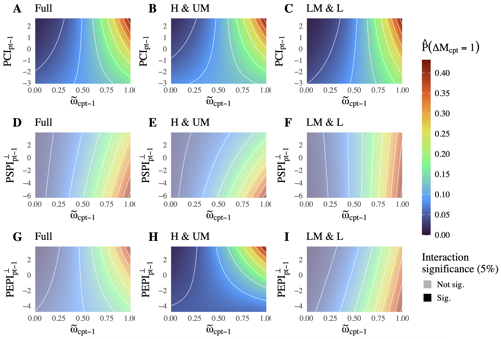
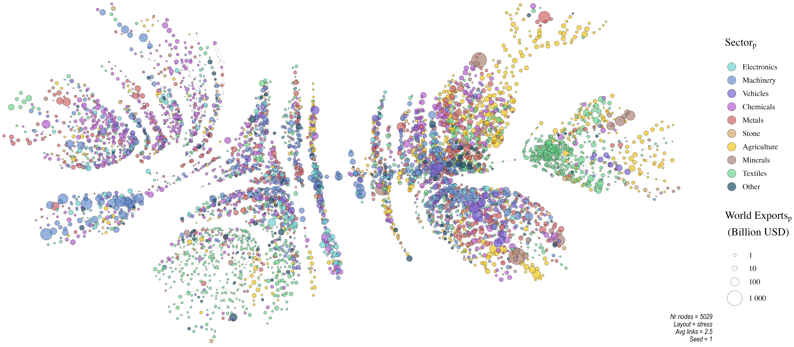
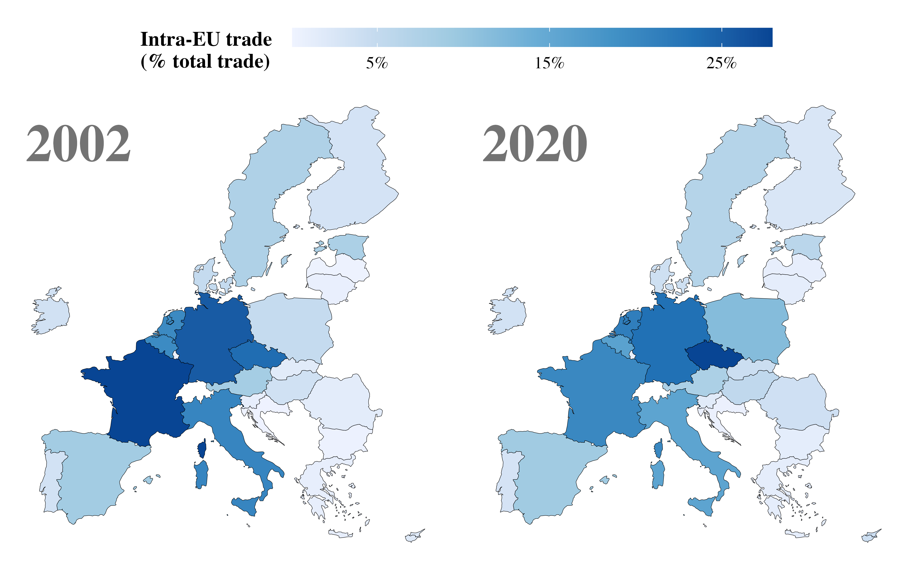
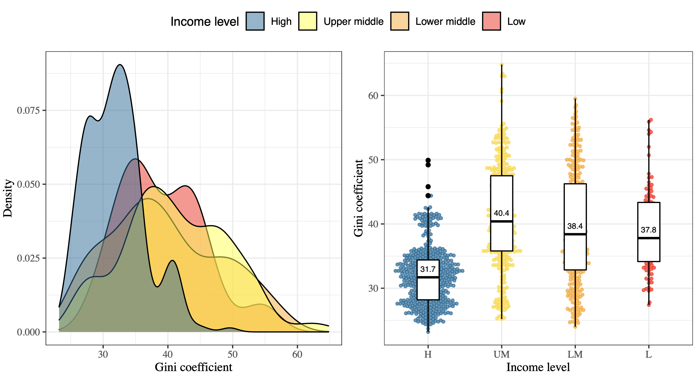

# Research

## 2026

    

        <!--  -->
        
    

    

        <h3 class="publication-title">
            <a>
                Estimating Product-Level Indicators from Trade Data Using Debiased Machine Learning
            </a>
        </h3>
        
Work in Progress

        
Quinten De Wettinck

        
2026

        

            Debiased Machine Learning
            Product Sustainability
            Trade
        

    

## 2025

    

        <a href="https://arxiv.org/abs/2509.17919" target="_blank" rel="noopener">
            <!--  -->
            
        </a>
    

    

        <h3 class="publication-title">
            <a href="https://arxiv.org/abs/2509.17919" class="publication-link" target="_blank" rel="noopener">
                Economic Complexity Alignment and Sustainable Development
            </a>
        </h3>
        
Preprint

        
Quinten De Wettinck, Karolien De Bruyne, Wouter Bam, César Hidalgo

        
2025

        

            Economic Complexity
            Sustainability Alignment
            Export Diversification
            <a href="https://arxiv.org/abs/2509.17919" class="tag tag-arxiv" target="_blank" rel="noopener">ARXIV</a>
            <a href="https://github.com/quintendewettinck/complexity-alignment" class="tag tag-github" target="_blank" rel="noopener">GITHUB</a>
        

    

    

        
    

    

        <h3 class="publication-title">
            <a href="https://papers.ssrn.com/sol3/papers.cfm?abstract_id=5412234" class="publication-link" target="_blank" rel="noopener">
                Economic Complexity: Promise and Potential for Sustainable Development Decision Support
            </a>
        </h3>
        
Preprint

        
Quinten De Wettinck, Karolien De Bruyne, Wouter Bam

        
2025

        

            Economic Complexity
            Sustainability Development
            Literature Review
            <a href="https://papers.ssrn.com/sol3/papers.cfm?abstract_id=5412234" class="tag tag-arxiv" target="_blank" rel="noopener">SSRN</a>
        

    

## 2024

    

        
    

    

        <h3 class="publication-title">
            <a href="https://www-jstor-org.kuleuven.e-bronnen.be/stable/27291360?seq=15" class="publication-link" target="_blank" rel="noopener">
                The Impact of Economic Integration on Income Inequality in the EU
            </a>
        </h3>
        
Journal of Economic Integration

        
Quinten De Wettinck, Aad van Mourik

        
2024

        

            Economic Integration
            Income Inequality
            <a href="https://www-jstor-org.kuleuven.e-bronnen.be/stable/27291360?seq=15" class="tag tag-arxiv" target="_blank" rel="noopener">JEI</a>
        

    

## 2023

    

        
    

    

        <h3 class="publication-title">
            <a href="https://lirias.kuleuven.be/retrieve/4bd8576e-2106-4de1-8845-a4f1a751b9a1" class="publication-link" target="_blank" rel="noopener">
                The Moderating Role of Economic Development on the Relation Between Economic Integration and Income Inequality
            </a>
        </h3>
        
Master's Thesis

        
Quinten De Wettinck, Aad van Mourik

        
2023

        

            Trade Integration
            Income Inequality
            <a href="https://lirias.kuleuven.be/retrieve/4bd8576e-2106-4de1-8845-a4f1a751b9a1" class="tag tag-arxiv" target="_blank" rel="noopener">LIRIAS</a>
        

    

